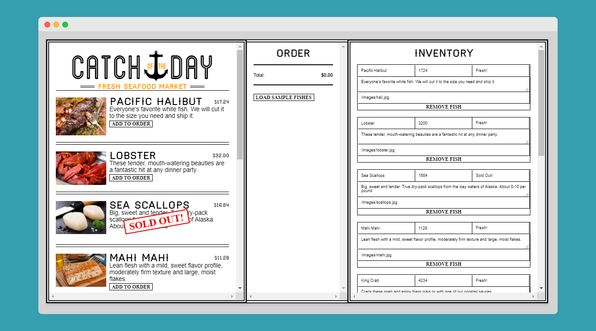
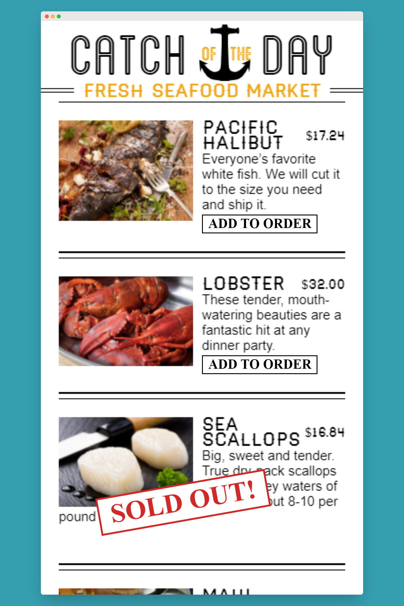
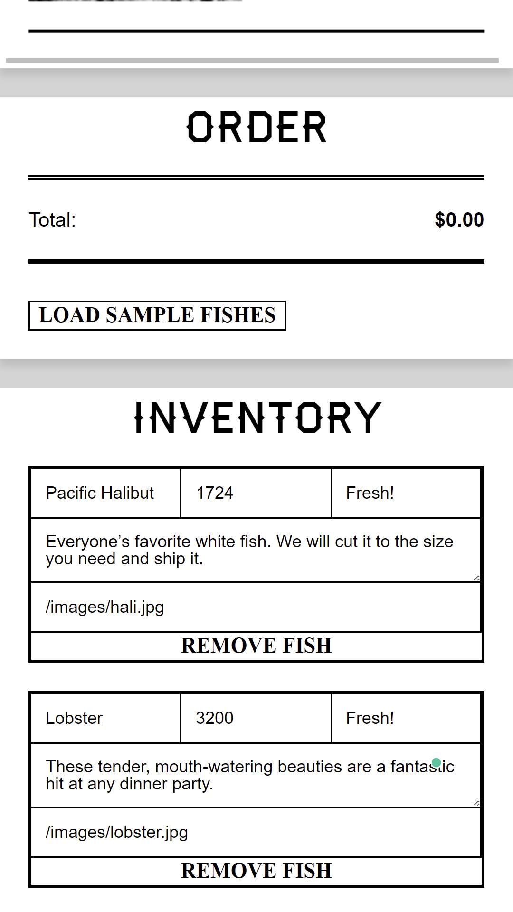

# Seafood Market

https://seafood1.netlify.app/

A real-time app for a trendy seafood market where price and quantity available are variable and can change at a moment's notice. The frontend has a menu, an order form, and an inventory management area where users can immediately update product details.

Technologies used: React, Firebase, React Router, localStorage, JavaScript, HTML, CSS, Netlify

 
